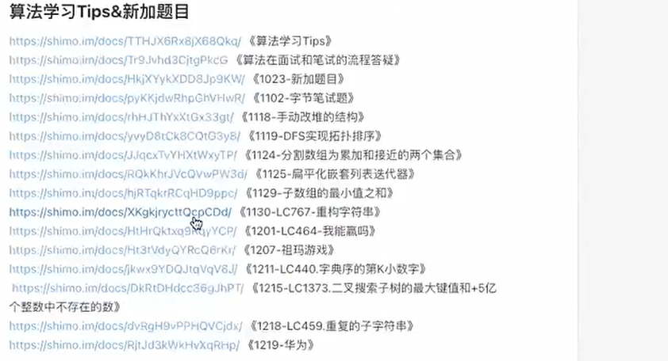

## 01 位运算 算法是什么 简单排序

#### 取出一个数的二进制 
位运算不知道优先级 就 多加括号
这里的整数的最小值的负数 或者取反+1都是其自己 
如果你觉得某个算法中数据出现这种情况是一种问题 那么就不应该采用int 而是 long
```java
public class Code01GetBinary {
    public static void printBinary(int num){
        for (int i = 31; i >= 0; i--) {
            String value = (num & (1 << i)) != 0 ? "1" : "0";
            System.out.print(value);
        }
        System.out.println();
    }
    public static void main(String[] args) {
        //深刻理解 为什么负数 要取反 + 1 这是为了其他的+ - * / 都可以使用一套逻辑
        int num = Integer.MIN_VALUE;
        printBinary(num);
        //一个数 取反 + 1 就等于其相反数
        printBinary(~num + 1);
        printBinary(-num);
    }
}
```
#### 算法是什么
是指解题方案的准确而完整的描述，是一系列解决问题的清晰指令，算法代表着用系统的方法描述解决问题的策略机制
#### 算法的分类
1 怎么算
2 怎么尝试 最伟大的思想
#### 阶乘的求和
输入 N
输出 1! + 2! + ... + N! 
没什么说的 就是引入 算法有优劣
```java
public class Code02FactorySum {

    public static long factory(int num){
        long result = 1L;
        for (int i = 2; i <= num; i++) {
            result *= i;
        }
        return result;
    }

    public static long getFactorySum(int num){
        long result = 0;
        for (int i = 1; i <= num; i++) {
            result += factory(i);
        }
        return result;
    }

    public static long getFactorySum2(int num){
        long result = 0;
        long cur = 1;
        for (int i = 1; i <= num; i++) {
            cur *= i;
            result += cur;
        }
        return result;
    }
    public static void main(String[] args) {
        System.out.println(getFactorySum(10));
        System.out.println(getFactorySum2(10));
    }

}
```
#### 选择排序
```java
public static void selectSort(int[] arr){
        if(arr == null){
            return;
        }
        //0 - N - 1
        for (int i = 0; i < arr.length - 1; i++) {
            int minIndex = i;
            // i + 1 - N  上面的N - 1保证了这里的i + 1不会越界
            for (int j = i + 1; j < arr.length; j++) {
                minIndex = arr[minIndex] > arr[j] ? j : minIndex;
            }
            swap(arr,minIndex,i);
        }
    }
```
#### 冒泡排序
```java
public static void bubbleSort(int[] arr) {
        if(arr == null){
            return;
        }
        // N - 1
        for (int i = arr.length - 1; i >= 1; i--) {
            //0 - i 按道理说应该可以到达 i 但是 我们想要 j 和 j + 1进行操作 于是就 这样了
            for (int j = 0; j < i; j++) {
                if(arr[j] > arr[j + 1]){
                    swap(arr,j, j+1);
                }
            }
        }
    }
```

#### 插入排序 
```java
 public static void insertSort(int[] arr) {
        if (arr == null) {
            return;
        }
        for (int i = 1; i < arr.length; i++) {
            for (int j = i - 1; j >= 0 && arr[j] > arr[j + 1] ; j--) {
                swap(arr, j, j + 1);
            }
        }
    }
```

## 数据结构 前缀和 对数器

#### 数据结构
计算机最基础的结构
1 连续 (线性 数组)
2 跳转 (非线性 带指针)
所有复杂的数据结构都是这两个的各种组合

最基本的数据结构
1 数组结构 : 寻址容易 增删复杂
2 跳转结构 : 寻址复杂 增删容易


#### 数据结构小设计
前缀和

我要非常频繁的查询 数组 L - R上的和
方式一 : 生成二维数组
方式二 : 生成前缀和数组
#### Math.random()
1 max(r(),r())
2 min(r(),r())

面试题 


1 根据黑盒生成 0|1生成器 偶数对半分 奇数扔掉一个
2 根据需要的范围 确定二进制的位数 确保这个二进制的数大于需要的范围长度
3 根据0|1生成器 每一位随机生成一次, 生成2步骤中的随机数
4 如果落在了多余的范围 就重新获取随机 

#### 对数器的验证 


## 二分 复杂度 动态数组 哈希表

#### 二分法


无序,相邻不相等

#### 时间复杂度

#### 动态数组
1 具有扩容行为
加入N个数 扩容总代价 O(N)
均摊到每一步 : O(1)
ArrayList 添加复杂度 O(1) 只是比固定数组的常数时间差
#### 哈希表 和 有序表

哈希表 增删改查都是O(1)时间 但是常数时间很大 
内存占用比较多

有序表
会按照key进行排序 (重写compareTo 或传入 Comparator)
所有的操作 O(logN) 
 
treeMap.firstKey()
treeMap.lastKey() 
treeMap.floorKey()
treeMap.ceilingKey()


## 链表
目前的感受是 使用哨兵节点 dummy会简化代码 善于使用dummy;

#### 链表的定义
链表执行的null不是实际的null而是一块jvm的特殊内存 被标记 为null

#### 单双链表的反转
#### 单链表模拟栈队列
#### 双链表模拟双端队列
对于用单链表模拟双端队列
头部可以做到插入和删除
尾部只能做到插入 因此无法实现

#### K个节点 组内逆序调整

 

#### 两个链表相加


#### 两个有序链表的合并


## 位图

#### 位图
##### 位图的功能
每一位0,1表示是否存在  int 可以表示 0 - 31 

提升 : 
如何用int表示 0 - 1023  -> int[32] 

做出一个集合 数字的范围要求确定
##### 位图的好处
极大的压缩空间
##### 位图的实现

#### 位运算实现 + - * /

##### +

##### -

##### *

##### /


## 比较器 优先级队列 二叉树
#### 比较器

#### 优先级队列

#### 二叉树
##### 相同的树
##### 镜像的树
##### 树的高度
##### 前序和中序构建一个树
##### 递归前中后序遍历


## 二叉树
#### 按层遍历并收集节点
java中栈比较慢 使用LinkedList代替 更快(从尾部加入 从尾部弹出)
最快的是在知道最大容量的时候使用数组实现
#### 判断是不是平衡搜索二叉树

##### 判断是不是平衡数 
每一颗子树 左树高度和右树高度差不超过一
##### 判断是不是搜索二叉树

#### 能否组成路径和
path-sum

####
path-sum-i